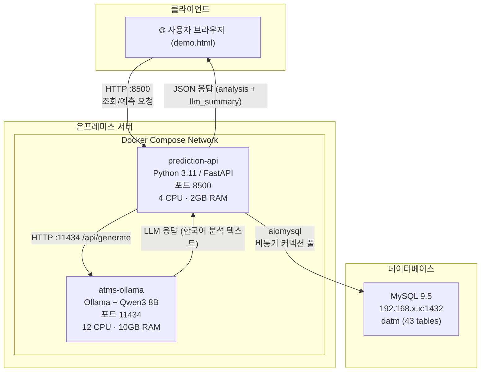
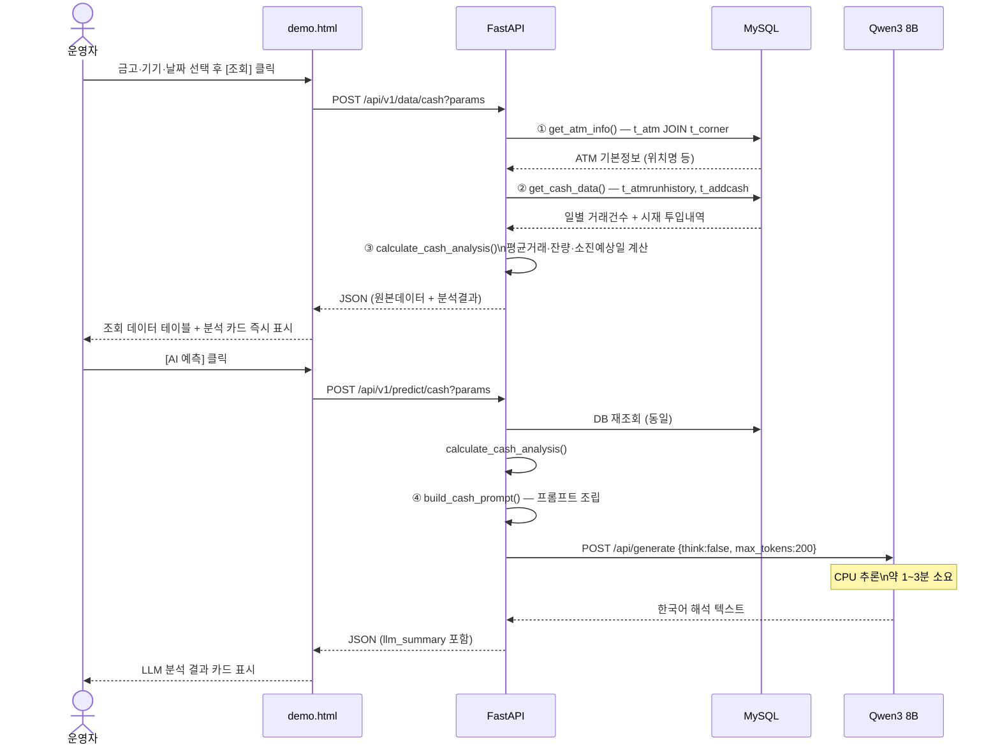
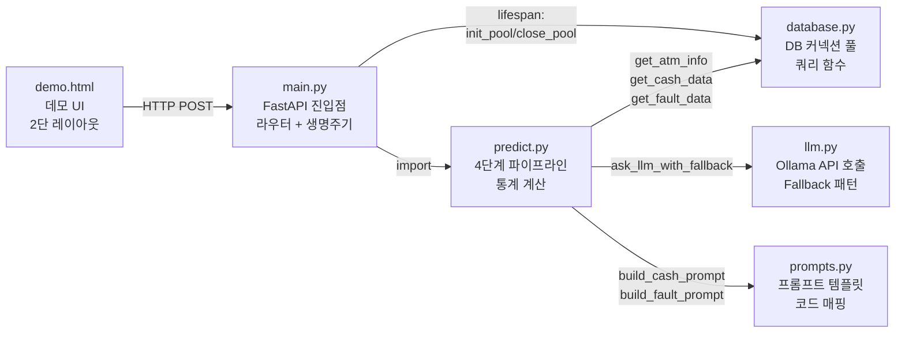
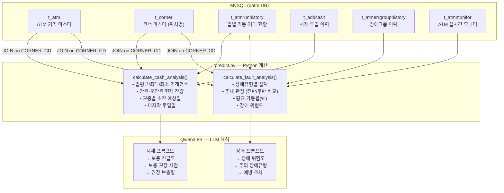

# ATMS LLM 예측 모듈 — 아키텍처 다이어그램

---

## 1. 전체 시스템 구성

```mermaid
graph TB
    subgraph Client["클라이언트"]
        Browser["🌐 사용자 브라우저 (demo.html)"]
    end

    subgraph DockerHost["온프레미스 서버\nCentOS 7 · Xeon Silver 4208 32-core · 62GB RAM"]
        subgraph DockerCompose["Docker Compose Network"]
            API["prediction-api\nPython 3.11 / FastAPI\n포트 8500\n4 CPU · 2GB RAM"]
            Ollama["atms-ollama\nOllama + Qwen3 8B\n포트 11434\n12 CPU · 10GB RAM"]
        end
    end

    subgraph DB["데이터베이스"]
        MySQL["MySQL 9.5\n192.168.x.x:1432\ndatm (43 tables)"]
    end

    Browser -->|"HTTP :8500\n조회/예측 요청"| API
    API -->|"HTTP :11434 /api/generate"| Ollama
    API -->|"aiomysql\n비동기 커넥션 풀"| MySQL
    Ollama -->|"LLM 응답 (한국어 분석 텍스트)"| API
    API -->|"JSON 응답 (analysis + llm_summary)"| Browser
```

---

## 2. 요청 처리 파이프라인

```mermaid
sequenceDiagram
    actor User as 운영자
    participant UI as demo.html
    participant API as FastAPI
    participant DB as MySQL
    participant LLM as Qwen3 8B

    User->>UI: 금고·기기·날짜 선택 후 [조회] 클릭
    UI->>API: POST /api/v1/data/cash?params
    API->>DB: ① get_atm_info() — t_atm JOIN t_corner
    DB-->>API: ATM 기본정보 (위치명 등)
    API->>DB: ② get_cash_data() — t_atmrunhistory, t_addcash
    DB-->>API: 일별 거래건수 + 시재 투입내역
    API->>API: ③ calculate_cash_analysis()\n평균거래·잔량·소진예상일 계산
    API-->>UI: JSON (원본데이터 + 분석결과)
    UI-->>User: 조회 데이터 테이블 + 분석 카드 즉시 표시

    User->>UI: [AI 예측] 클릭
    UI->>API: POST /api/v1/predict/cash?params
    API->>DB: DB 재조회 (동일)
    API->>API: calculate_cash_analysis()
    API->>API: ④ build_cash_prompt() — 프롬프트 조립
    API->>LLM: POST /api/generate {think:false, max_tokens:200}
    Note over LLM: CPU 추론\n약 1~3분 소요
    LLM-->>API: 한국어 해석 텍스트
    API-->>UI: JSON (llm_summary 포함)
    UI-->>User: LLM 분석 결과 카드 표시
```

---

## 3. 모듈 의존 관계

```mermaid
graph LR
    main["main.py\nFastAPI 진입점\n라우터 + 생명주기"]
    predict["predict.py\n4단계 파이프라인\n통계 계산"]
    database["database.py\nDB 커넥션 풀\n쿼리 함수"]
    llm["llm.py\nOllama API 호출\nFallback 패턴"]
    prompts["prompts.py\n프롬프트 템플릿\n코드 매핑"]
    demo["demo.html\n데모 UI\n2단 레이아웃"]

    main -->|"import"| predict
    main -->|"lifespan:\ninit_pool/close_pool"| database
    predict -->|"get_atm_info\nget_cash_data\nget_fault_data"| database
    predict -->|"ask_llm_with_fallback"| llm
    predict -->|"build_cash_prompt\nbuild_fault_prompt"| prompts
    demo -->|"HTTP POST"| main
```

---

## 4. 데이터 흐름 상세

```mermaid
flowchart TD
    subgraph DB["MySQL (datm DB)"]
        T1["t_atm\nATM 기기 마스터"]
        T2["t_corner\n코너 마스터 (위치명)"]
        T3["t_atmrunhistory\n일별 가동·거래 현황"]
        T4["t_addcash\n시재 투입 이력"]
        T5["t_atmerrgrouphistory\n장애그룹 이력"]
        T6["t_atmmonitor\nATM 실시간 모니터"]
    end

    subgraph Python["predict.py — Python 계산"]
        CASH["calculate_cash_analysis()\n• 일평균/최대/최소 거래건수\n• 만원·오만원 현재 잔량\n• 권종별 소진 예상일\n• 마지막 투입일"]
        FAULT["calculate_fault_analysis()\n• 장애유형별 집계\n• 추세 판정 (전반/후반 비교)\n• 평균 가동률(%)\n• 장애 위험도"]
    end

    subgraph LLMLayer["Qwen3 8B — LLM 해석"]
        CASHP["시재 프롬프트\n→ 보충 긴급도\n→ 보충 권장 시점\n→ 권장 보충량"]
        FAULTP["장애 프롬프트\n→ 장애 위험도\n→ 주의 장애유형\n→ 예방 조치"]
    end

    T1 & T2 -->|"JOIN on CORNER_CD"| CASH & FAULT
    T3 & T4 --> CASH
    T5 & T6 & T3 --> FAULT
    CASH --> CASHP
    FAULT --> FAULTP
```
