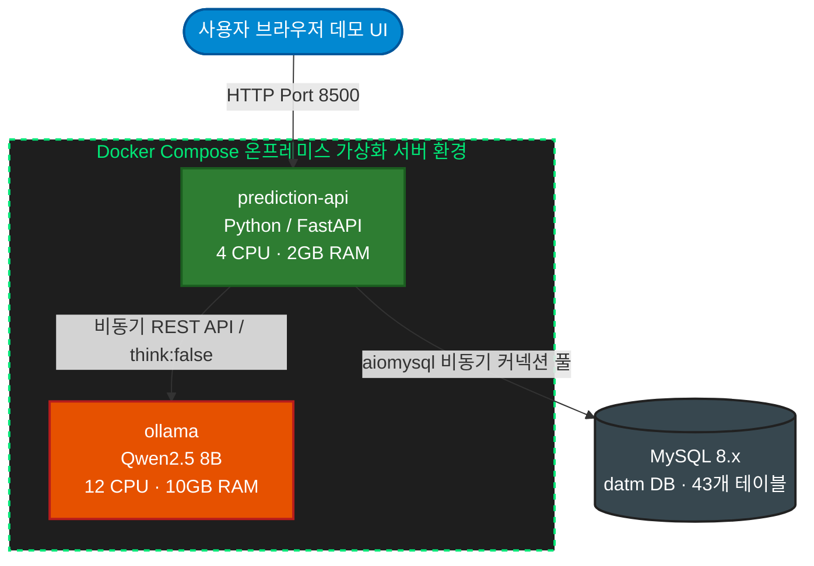

# [Portfolio] AI 기반 현업 운영 효율화 및 AX 자동화 솔루션 구축

## 프로젝트: ATM 시재 예측 및 장애 분석 온프레미스 LLM 모듈 구축 (PoC)
> **비즈니스 목적**: 수백 대의 금융기기 데이터를 실시간으로 모니터링해야 하는 현업 부서의 공수를 줄이고, 정량 데이터 기반의 즉각적인 의사결정을 지원하는 AI Agent 자동화 파이프라인 개발

---

## 1. 개요 및 핵심 성과

* **현업 문제 정의 (Pain Point)**
  * 기존 ATM 운영 시스템(ATMS) 환경에서는 담당자가 수십~수백 대 기기의 시재(현금) 변동 및 복잡한 장애 코드를 일일이 수동으로 조회·분석해야 하는 과도한 모니터링 리소스 발생
* **솔루션 제안**
  * 인프라 내 축적된 대용량 시재·장애 정량 데이터를 **Python 백엔드가 고속 집계·통계 처리**하고, **온프레미스 LLM이 현업 운영자의 언어(한국어 의사결정 리포트)로 요약 및 해석**해 주는 실시간 4단계 자동화 파이프라인 설계
* **핵심 성과**
  * **아키텍처 분리를 통한 신뢰성 확보**: 계산(Python)과 해석(LLM)을 철저히 분리하여 생성형 AI의 수치적 환각(Hallucination)을 100% 방지하고, 예외 발생 시 시스템 안정성을 보장하는 **Fallback 매커니즘** 구현
  * **추론 가속화 및 속도 최적화**: 로컬 CPU 인프라 환경을 고려해 불필요한 사유(Thinking) 프로세스 비활성화(`think:false`) 및 프롬프트 제어를 통해 응답 지연 시간을 기존 대비 **약 18배 단축 (32분 ➔ 1분 45초)**
  * **현업 검증용 Web UI 시각화**: 외부 의존성 없는 단일 파일 기반 데모 UI를 직접 개발하여 현업 부서에 실시간 데이터 시각화 및 직관적인 AX(AI Transformation) 경험 제공

---

## 2. 시스템 아키텍처 및 기술 스택

### 시스템 아키텍처

---

### 기술 스택 명세
* **Backend**: Python 3.11, FastAPI, Uvicorn
* **Asynchronous DB Connector**: aiomysql (비동기 커넥션 풀링 및 논블로킹 쿼리 제어)
* **AI / LLM**: Ollama 환경 기반 Qwen2.5 8B (폐쇄망 타겟팅 온프레미스 경량 LLM)
* **Frontend / UI**: Vanilla HTML5, CSS3, JavaScript (대시보드 시각화)
* **Infrastructure**: Docker, Docker Compose, MySQL 8.x

---

## 3. 핵심 구현 내용 및 담당 역할

### ① 현업 요구사항 기반 '결정론적 AI 파이프라인' 설계 및 주도
* **역할 분리 설계**: LLM에게 직접 연산이나 통계를 맡길 경우 발생하는 결과의 일관성 결여 문제를 해결하기 위해, 정량적 연산은 Python 백엔드가 전담하고 LLM은 최종 결과의 '문맥 요약 및 액션 플랜 수립'만 담당하도록 파이프라인 표준화
* **4단계 요청 처리 프로세스 자동화**:
  1. **DB 조회**: 비동기 드라이버 기반 대용량 이력 데이터 호출
  2. **Python 계산**: 통계 기반 권종별 소진일 예측 알고리즘 및 장애 위험도 집계
  3. **LLM 해석**: 구조화된 컨텍스트 프롬프트를 기반으로 로컬 LLM이 한국어 리포트 생성
  4. **응답 반환**: 정량 분석 데이터(`analysis`)와 자연어 요약(`llm_summary`)이 결합된 통합 JSON 객체 반환

### ② 대용량 시재·장애 데이터 가공 및 통계 추출 (SQL 역량)
* **비동기 커넥션 관리**: FastAPI의 `lifespan` 컨텍스트 매니저를 활용하여 애플리케이션 시작 시 `aiomysql` 풀을 안정적으로 생성하고 종료 시 자원을 반환하는 자원 최적화 구현
* **도메인 데이터 정밀 가공**:
  * **시재 분석 알고리즘**: 복합키(`TERM_GROUP_ID + TERM_ID`)를 활용해 각 ATM을 식별하고, 일별 거래 건수 및 시재 투입 내역 이력을 분석하여 만원권·오만원권의 권종별 일평균 소진량 및 소진 예상일을 연산하는 정량 로직 개발 (오만원권의 권종별 트래픽 가중치 30% 반영 가중 평균 기법 적용)
  * **장애 분석 알고리즘**: `t_atmerrgrouphistory`를 포함한 다중 테이블을 비동기 JOIN하여 최다 발생 장애 유형을 추출하고, 전반기 대비 후반기 발생 건수를 비교하여 장애 추세(증가/감소/유지)를 판정하는 통계 로직 구현

### ③ 프롬프트 엔지니어링 및 성능 최적화 (LLM 역량)
* **토큰 제어를 통한 가속화**: LLM 프롬프트 내에 코드 매핑 사전(`ERR_GROUP_NAMES` 등)을 임베딩하여 원시 코드를 한글 명칭으로 즉시 매핑하고, **"3문장 이내로 핵심만 요약"**하도록 지시어를 제어하여 불필요한 토큰 생성을 차단, 응답 속도 대폭 개선
* **엔지니어링 기반 성능 최적화**: CPU 기반 추론 인프라 스펙을 고려하여 Ollama 호출 시 불필요한 사유 프로세스를 생략하는 `think:false` 강제 옵션 적용 및 타임아웃 튜닝을 통해 **전체 파이프라인 처리 시간을 32분에서 1분 45초로 약 94.5% 단축**
* **결정론적 Fallback 아키텍처 구축**: 인프라 과부하나 네트워크 지연으로 인해 LLM 응답이 실패하거나 타임아웃이 발생하더라도, Python 백엔드가 미리 계산해 둔 표준 통계 메시지를 즉시 조립하여 JSON 형태로 정상 응답을 보장하는 예외 복원력(Resilience) 확보

### ④ 현업 소통용 데이터 시각화 및 데모 UI 개발
* **직관적인 2단 레이아웃 설계**: 외부 라이브러리 의존성 없이 단일 HTML 파일로 구성된 대시보드 화면을 직접 개발하여 좌측에는 DB 원본 데이터 테이블을, 우측에는 LLM이 해석한 핵심 리포트 카드(보충 긴급도, 예방 조치 등)를 배치
* **UX 개선**: 즉시 응답 가능한 '데이터 조회'와 연산 시간이 소요되는 'AI 예측' 버튼을 분리하고, LLM 추론 대기 중 실시간 경과 타이머를 화면에 표기하여 현업 사용자의 체감 대기 시간 감소 및 편의성 제어

---

## 4. 상세 기능 명세 (API 및 모듈 구조)

### 주요 API 엔드포인트 (`main.py`)
* `GET /api/v1/status`: 인프라(Ollama 모듈 및 DB 엔드포인트) 연결 상태 모니터링
* `POST /api/v1/predict/cash`: 시재 정량 통계 및 AI 기반 권종별 보충 긴급도/권장 보충량 리포트 생성
* `POST /api/v1/predict/fault`: 장애 데이터 집계 및 AI 기반 예방 조치 제안 리포트 생성

### 파일별 아키텍처 역할 분담
* `database.py`: `aiomysql`을 이용한 43개 테이블 대상 대용량 운영 데이터 비동기 조회
* `predict.py`: 파이프라인 총괄 및 Python 기반 정량 통계 알고리즘 연산 처리, Fallback 메시지 빌드
* `prompts.py`: LLM 전달용 구조화 프롬프트 템플릿 관리 및 코드-자연어 매핑 데이터 정의
* `llm.py`: Ollama API 비동기 통신 및 `think:false` 옵션을 활용한 추론 가속화 제어
