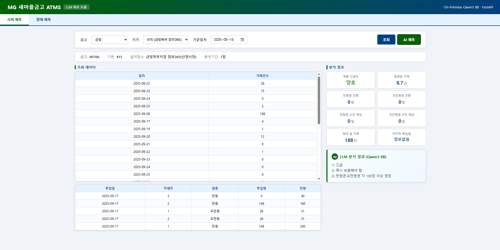

# ATMS LLM 예측 모듈

> **ATM 기기의 시재(현금) 및 장애 데이터를 온프레미스 LLM으로 분석·해석하는 PoC 프로젝트**

---

## 개요

금융기관 ATM 운영 시스템(ATMS)의 운영자는 수십~수백 대의 ATM 기기 상태를 일일이 확인해야 합니다.  
이 프로젝트는 DB에 축적된 시재·장애 데이터를 **Python이 정량 분석**하고, **온프레미스 LLM이 운영자 언어로 해석**하여 의사결정을 지원합니다.

### 핵심 설계 원칙

> **"LLM은 예측하지 않습니다 — LLM은 해석합니다"**

- **예측(계산)**: Python이 DB 데이터를 집계·통계 처리 → 결정론적 결과 보장
- **해석(요약)**: LLM이 계산 결과를 운영자가 이해하기 쉬운 한국어로 변환
- **Fallback**: LLM 실패 시에도 Python이 만든 기본 메시지로 항상 정상 응답

---

## 아키텍처

```
사용자 브라우저
    │ HTTP (포트 8500)
    ▼
┌──────────────────────────────────────────────────────┐
│ Docker Compose (CentOS 7 · Xeon Silver 4208 · 62GB) │
│                                                      │
│  ┌─────────────────────┐    ┌───────────────────┐   │
│  │  prediction-api     │    │     ollama        │   │
│  │  (Python / FastAPI) │───▶│  (Qwen3 8B)       │   │
│  │  4 CPU · 2GB RAM    │    │  12 CPU · 10GB RAM│   │
│  └────────┬────────────┘    └───────────────────┘   │
│           │ aiomysql                                 │
└───────────┼──────────────────────────────────────────┘
            │
            ▼
     MySQL 9.5 (datm DB · 43 tables)
     ATM 운영 데이터 (2025-08 ~ 2025-10)
```

### 요청 처리 흐름 (4단계 파이프라인)

```
① DB 조회           ② Python 계산          ③ LLM 해석            ④ 응답 반환
────────────        ──────────────         ──────────────        ──────────
get_cash_data()  →  calculate_cash_  →   build_cash_prompt()  →  JSON
get_fault_data()    analysis()            ask_llm_with_         (analysis +
                    (통계·집계·           fallback()            llm_summary)
                     소진일 계산)         [Qwen3 8B]
```

---

## 주요 기능

| 기능 | 설명 |
|------|------|
| **시재 조회** | DB 원본(일별 거래건수, 투입내역) 즉시 조회 |
| **시재 분석** | 만원권·오만원권 소진 예상일, 일평균 거래 등 통계 계산 |
| **시재 AI 예측** | LLM이 보충 긴급도·시점·권장 보충량 자연어 해석 |
| **장애 조회** | 장애이력, 가동률 현황 즉시 조회 |
| **장애 분석** | 장애유형별 집계, 추세(증가/감소/유지), 위험도 판정 |
| **장애 AI 예측** | LLM이 장애 위험도·주의 유형·예방 조치 자연어 해석 |

---

## 파일별 역할

### `main.py` — FastAPI 앱 진입점

```
담당 역할: HTTP 라우트 정의, 앱 생명주기 관리
```

| 엔드포인트 | 설명 |
|-----------|------|
| `GET /health` | 서비스 상태 확인 |
| `GET /api/v1/status` | Ollama·DB 연결 상태 |
| `POST /api/v1/data/cash` | 시재 조회 (즉시 응답) |
| `POST /api/v1/data/fault` | 장애 조회 (즉시 응답) |
| `POST /api/v1/predict/cash` | 시재 AI 예측 (LLM 호출) |
| `POST /api/v1/predict/fault` | 장애 AI 예측 (LLM 호출) |
| `GET /demo` | 데모 웹 UI |

- `lifespan` 컨텍스트 매니저로 앱 시작 시 DB 커넥션 풀 생성, 종료 시 반환
- CORS 미들웨어 추가 (브라우저 직접 접근 허용)

---

### `database.py` — DB 커넥션 풀 · 쿼리

```
담당 역할: aiomysql 비동기 커넥션 풀 관리, ATM 데이터 조회
```

| 함수 | 쿼리 테이블 | 설명 |
|------|------------|------|
| `init_pool()` / `close_pool()` | - | 앱 시작/종료 시 풀 생성/반환 |
| `get_atm_info()` | `t_atm` + `t_corner` | ATM 기본정보 (위치명 JOIN 포함) |
| `get_cash_data()` | `t_atmrunhistory`, `t_addcash` | 일별 거래건수 + 시재 투입내역 |
| `get_fault_data()` | `t_atmerrgrouphistory`, `t_atmrunhistory`, `t_atmmonitor` | 장애이력 + 가동률 + 현재상태 |

- 모든 함수 비동기(`async`) — FastAPI 이벤트 루프와 통합
- `base_date` 파라미터로 과거 특정 시점 기준 조회 지원 (테스트 데이터 대응)
- `TERM_GROUP_ID + TERM_ID` 복합키로 ATM 식별

---

### `llm.py` — Ollama API 호출

```
담당 역할: LLM 통신, Fallback 패턴으로 장애 복원력 확보
```

| 함수 | 설명 |
|------|------|
| `ask_llm()` | Ollama `/api/generate` 호출, `think:false` 강제 (속도 최적화) |
| `ask_llm_with_fallback()` | LLM 실패 시 사전 작성된 메시지 반환 |

**속도 최적화 이력**:
- Qwen3 Thinking 모드 ON: **32분** → think:false 설정: **1분 45초** (10배 개선)
- 타임아웃 600초 (CPU 추론 환경 고려)

---

### `prompts.py` — 프롬프트 엔지니어링

```
담당 역할: LLM에게 전달할 프롬프트 조립, 코드→한글 매핑
```

- `build_cash_prompt()`: 시재 분석 데이터를 구조화된 프롬프트로 변환
- `build_fault_prompt()`: 장애 분석 데이터를 구조화된 프롬프트로 변환
- **"3문장 이내로 핵심만"** 지시로 토큰 생성량 제한 → 응답 속도 향상
- 코드 매핑 딕셔너리: `ERR_GROUP_NAMES`, `ATM_STATUS_NAMES`, `CASH_STATUS_NAMES`

---

### `predict.py` — 핵심 예측 파이프라인

```
담당 역할: 4단계 파이프라인 실행, Python 통계 계산
```

**시재 예측 계산 로직** (`calculate_cash_analysis`):
- 일별 거래건수 → 평균/최대/최소 산출
- 최근 잔량 × 일평균 거래 → 권종별 소진 예상일 계산
- 오만원권은 만원권 대비 30% 사용 비율 적용

**장애 분석 로직** (`calculate_fault_analysis`):
- 장애그룹코드별 집계 + 최다 유형 추출
- 전반기 vs 후반기 건수 비교 → 추세 판정 (1.3배 기준)
- 가동시간/목표시간 → 가동률(%) 계산

**Fallback 빌더**: LLM 실패 시에도 항상 의미있는 응답 보장

---

### `demo.html` — 데모 웹 UI

```
담당 역할: 단일 HTML 파일 기반 데모 화면 (외부 의존성 없음)
```

- **2단 레이아웃**: 좌측(조회 데이터 테이블) + 우측(분석 카드 + LLM 결과)
- **조회 / AI 예측 버튼 분리**: 즉시 응답 vs LLM 호출 사용자 경험 분리
- 경과시간 타이머: LLM 응답 대기 중 실시간 표시
- 기존 ATMS 디자인 테마 계승 (녹색-파랑 그라디언트, Pretendard 폰트)


---

## 기술 스택

| 구분 | 기술 |
|------|------|
| **LLM** | Qwen3 8B (Apache 2.0, 5.2GB) via Ollama |
| **Backend** | Python 3.11 · FastAPI · uvicorn |
| **DB 연결** | aiomysql (비동기 MySQL 클라이언트) |
| **인프라** | Docker · Docker Compose |
| **DB** | MySQL 9.5 (datm, 43 tables) |
| **Frontend** | Vanilla HTML/CSS/JS (단일 파일) |
